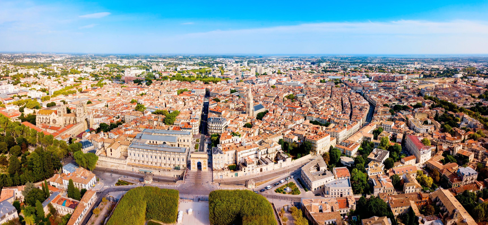

🎓 Fraichement diplômé d'un titre RNCP de niveau V "developpeur web et web mobile" en Mars 2023, je me concentre actuellement sur la **recherche d'une entreprise** afin d'effectuer une alternance pour un **bac+3 (1 an)** avec comme école Beweb ! (sur Montpellier et alentours)

<!--
**cblairy/cblairy** is a ✨ _special_ ✨ repository because its `README.md` (this file) appears on your GitHub profile.

Here are some ideas to get you started:

- 🔭 I’m currently working on ...
- 🌱 I’m currently learning ...
- 👯 I’m looking to collaborate on ...
- 🤔 I’m looking for help with ...
- 💬 Ask me about ...
- 📫 How to reach me: ...
- 😄 Pronouns: ...
- ⚡ Fun fact: ...
-->
